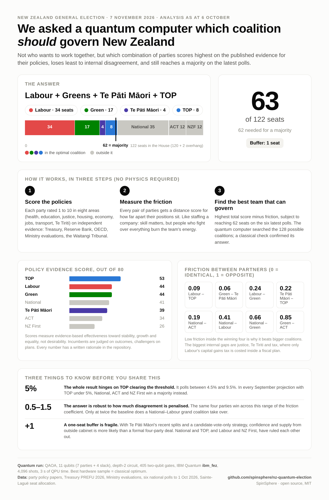

# NZ Quantum Election: QAOA coalition optimiser for the 2026 MMP election

[](https://qiskit.org)
[](https://quantum.cloud.ibm.com)
[](https://python.org)
[](LICENSE)

Which coalition of New Zealand's seven parliamentary parties would form the policy-optimal majority government after the 7 November 2026 election, if the only inputs were the published evidence on each party's policies, their ideological distance from one another, and the September 2026 polls?

This repository answers that question with a Quantum Approximate Optimization Algorithm (QAOA) built in Qiskit, run on an IBM Quantum Heron processor, and verified against classical brute force. It also contains the complete policy research, the scoring matrix with a written rationale for every number, and an executive report generator.

## Result




**Labour + Green + Te Pāti Māori + TOP: 63 of 122 seats (majority 62), objective 1.2125.**

Sampled from the QAOA circuit on `ibm_fez` (job `db21nrs7f06c73ap7g1g`, 3 seconds of QPU time; earlier runs on `ibm_fez` (`db20ak47f06c73ap5s10`) and `ibm_marrakesh` (`db1u21hmmimc73fnvhk0`) gave the same answer) and identical to the classical optimum. The classical ranking of the next best feasible coalitions is National + Labour + TOP (0.76), National + Labour (0.65) and National + Labour + NZ First (0.49). The incumbent National + ACT + NZ First bloc polls at 59 seats and cannot reach 62 without TOP, which National has ruled out; NZ First has in turn ruled out Labour. The answer hinges on TOP staying above the 5% threshold: it polls between 4.5% and 9.5%, and every September projection with TOP under 5% produces a National-led majority instead.

The answer holds for every friction coefficient between 0.5 and 1.5. At 2.0 and above the optimiser prefers the National + Labour grand coalition because it has the fewest partners. See the full executive report in [`docs/REPORT.md`](docs/REPORT.md).

| Party | Vote % (6-poll mean) | Seats | Policy score /80 |
|---|---|---|---|
| National | 28.5 | 35 | 41 |
| Labour | 28.0 | 34 | 44 |
| Green | 14.4 | 17 | 44 |
| ACT | 9.7 | 12 | 34 |
| NZ First | 9.8 | 12 | 26 |
| Te Pāti Māori | 1.8 | 4 | 39 |
| TOP | 6.4 | 8 | 53 |

Seats are Sainte-Laguë allocations from the mean of the six most recent polls (RNZ-Reid Research 24 Sep-1 Oct, Verian, Freshwater, Anacta, Curia, Roy Morgan), with Te Pāti Māori holding 4 Māori electorates (2 overhang seats), the assumption every published projection uses.

## How it works

```
research/*.md  ──►  policy_data.json  ──►  seat_model.py (Sainte-Laguë)
                      (scores, positions,          │
                       polls, electorates)         ▼
                                   quantum_nz_election.py
                                     objective + friction  ──►  QUBO (slack, scaled)  ──►  Ising H
                                     QAOA angles (Aer statevector, p = 1..4)
                                     SamplerV2 (Aer, 8192 shots)  +  IBM Quantum (job mode, 4096 shots)
                                     brute-force verification  ──►  quantum_results.json
                                                                          │
                                                             generate_report.py  ──►  terminal / docs/REPORT.md
```

1. **Research.** One research pass per party and one for polling, each writing a sourced markdown file in `research/`; supplemented on 6 October 2026 with the full policy PDFs of TOP, the Greens and Te Pāti Māori, 28 primary pages supplied by the project owner, and a Playwright crawl of news coverage (raw text in `research/raw/`).
2. **Scoring.** Each party gets a 1 to 10 effectiveness score in eight domains (health, education, crime and justice, housing, cost of living and economy, employment, transport and infrastructure, Te Tiriti o Waitangi and Māori issues). Each party is also placed on a -1 to +1 policy-position axis per domain. Both are in `policy_data.json` with a rationale per cell.
3. **Objective.** Maximise the sum of member policy weights minus a friction cost for every pair of partners proportional to their ideological distance, subject to a parliamentary majority. The brief's pure-linear objective is degenerate (every party has positive value, so the grand coalition always wins); friction is the term that makes the problem a real binary quadratic program and models what actually constrains coalition size under MMP.
4. **Encoding.** The seat constraint is written with binary slack variables after rescaling seats to the coarsest unit that reproduces the exact feasible set for all 128 coalitions (6 seats per unit, verified in code). Result: 7 party qubits + 4 slack qubits = 11 qubits, and a tenfold reduction in the penalty's dynamic range.
5. **QAOA.** `QAOAAnsatz` with COBYLA on an exact Aer statevector expectation for depths 1 to 4, then `qiskit_aer.primitives.SamplerV2` sampling. The depth-2 circuit is transpiled and run on the least-busy IBM Quantum backend with a 10-minute queue and wall-clock fallback to the local sampler.
6. **Report.** `generate_report.py` prints the executive summary, policy-impact analysis, MMP stability assessment and quantum breakdown from the two JSON files.

Full details, including every modelling choice and its limitations, are in [`METHODOLOGY.md`](METHODOLOGY.md).

## What the quantum part does and does not show

QAOA learns the majority constraint well: 88% of ideal samples and 66% of hardware samples are majority coalitions, against 60% for uniform random sampling. At depths 1 to 4 it only weakly resolves the policy objective (the optimum bitstring carries about six times the uniform probability), because the penalty term dominates the energy spectrum even after rescaling. The optimum is recovered by post-selecting the best feasible sample, which is how QAOA is used in practice. With 128 coalitions the problem is classically trivial and is brute-forced in the same script as a check. The point of the exercise is an auditable, end-to-end pipeline from policy evidence to a quantum circuit on real hardware, not a speed-up.

Hardware run summary (depth 2, 11 qubits, `ibm_fez`; the `ibm_marrakesh` run is in the git history):

| Metric | Hardware | Ideal simulation |
|---|---|---|
| Two-qubit (CZ) gates after transpilation | 405 | – |
| P(majority coalition) | 0.660 | 0.883 |
| P(exact optimum bitstring) | 0.0012 | 0.0021 |
| Total variation distance of coalition marginal | 0.246 | 0 |
| Best feasible sample | Lab + Grn + TPM + TOP | Lab + Grn + TPM + TOP |

## Run it yourself

```bash
git clone https://github.com/spinsphere/nz-quantum-election.git
cd nz-quantum-election
python -m venv .venv && source .venv/bin/activate
pip install -r requirements.txt

# optional: IBM Quantum hardware run (free Open plan is enough; ~3 s of QPU time)
cp .env.example .env            # then paste your IBM Quantum Platform API key into .env

python seat_model.py            # seat allocation from the poll average
python quantum_nz_election.py   # full pipeline; add --no-hardware to stay local
python generate_report.py       # executive report in the terminal
```

Useful flags: `--mu 1.5` changes the friction coefficient, `--max-p 6` deepens the QAOA sweep, `--hw-p 1` sends a shallower circuit to hardware, `--shots`, `--hw-shots`, `--queue-limit`.

To test your own view of the parties, edit the `scores` or `positions` in `policy_data.json` and re-run. To test a different election night, edit `metadata.polling_average` and `metadata.electorate_assumptions`.

## Repository layout

```
quantum_nz_election.py   main pipeline: objective, QUBO, Ising, QAOA, Aer and IBM sampling, verification
generate_report.py       executive report from quantum_results.json + policy_data.json
seat_model.py            Sainte-Laguë MMP seat allocation
policy_data.json         scores, positions, rationale, polls, electorate assumptions, declared rule-outs
quantum_results.json     output of the recorded run (6 Oct 2026, ibm_fez)
research/                sourced research files: polling.md and one per party, each with a 6 Oct update section
research/raw/            raw page text captured by the Playwright crawl (news, Wikipedia, official pages)
docs/REPORT.md           executive report from the recorded run
docs/infographic.png     one-page infographic of the result (source: docs/infographic.html)
docs/run_log.txt         console log of the recorded run
METHODOLOGY.md           every modelling choice, with limitations
linkedin_article.md      write-up for publication
.env.example             template for the IBM token (the real .env is git-ignored)
```

## Neutrality and limitations

Scores measure evidence-based effectiveness toward stability, growth and equality, not desirability. They are expert judgements and are documented cell by cell so they can be challenged. Three limitations matter most: independent-evidence coverage is uneven (strong for National, which is judged on outcome data; thinner for NZ First); incumbents are judged on outcomes while opposition parties are judged on plans, which likely flatters TOP; and the seat model is one polling scenario in which TOP sits half a point above the threshold that decides the result. None of this is an endorsement of any party. Change the inputs and the optimiser will give you a different government.

## Credits

Started with Google Antigravity, which ran out of budget; research, model, quantum pipeline, hardware run and documentation completed with Claude Code (Claude Fable 5.1). Built by [SpinSphere](https://github.com/spinsphere). MIT licence.
